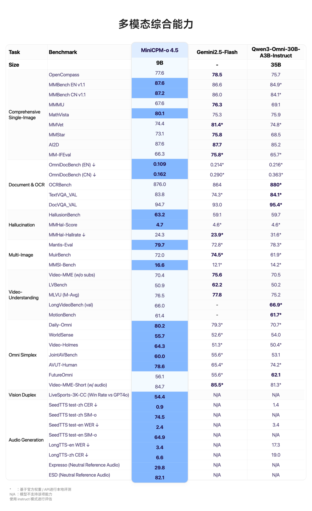
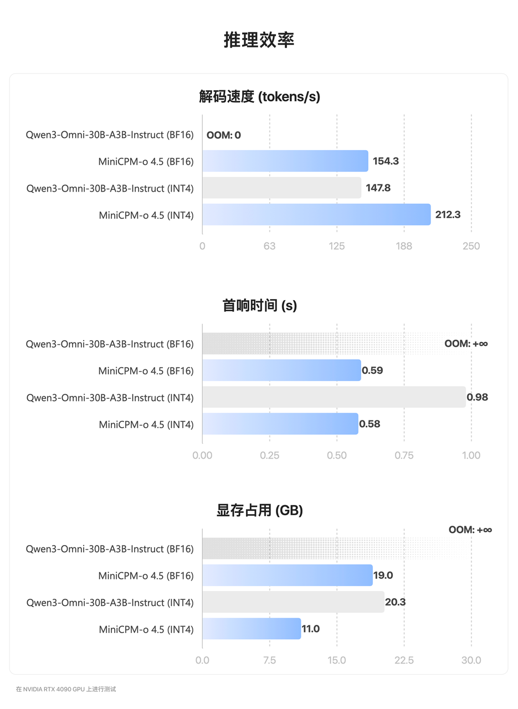
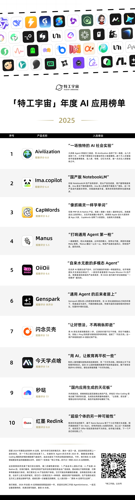

刚刚，面壁小钢炮开源进阶版「Her」，9B模型居然有了「活人感」

## 文章配图

---

图片
机器之心编辑部

你有没有想过一个问题：为什么和 AI 对话，总觉得少了点「人味儿」。

不是它回答得不够准确，也不是它理解不了你的意思，而是每次交互都很机械。

你问一句，等它答完，然后突然画面一转，对不起，它对现实世界的观察仿佛瞬间「掉线」。那几秒里，AI 仿佛顺手关掉了眼睛和耳朵，陷入一种「间歇性失明失聪」的状态，根本不能根据眼前瞬息万变的画面实时调整自己的反应。

这种感觉，就像两个人在用对讲机聊天。你按住通话键说话时，对方听不见；对方说话时，你也插不上嘴。一次只能一个方向传递信息。

这不是产品设计问题，而是技术限制。因为绝大多数 AI 都在用单工模式运行，用起来感觉很死板。

2 月 4 日，面壁开源了行业首个全双工全模态大模型 MiniCPM-o 4.5，相比已有多模态模型，MiniCPM-o 4.5 首次实现了「边看边听边说」以及「自主交互」的全模态能力，模型不再只是把视觉、语音作为静态输入处理，而是能够在实时、多模态信息流中持续感知环境变化，并在输出的同时保持对外界的理解。

目前，MiniCPM-o 4.5 已在 GitHub、Hugging Face 等平台开源：

开源地址：https://github.com/OpenBMB/MiniCPM-o

Hugging Face: https://huggingface.co/openbmb/MiniCPM-o-4_5

虽然参数量只有 9B，MiniCPM-o 4.5 却在全模态、视觉理解、文档解析、语音理解和生成、声音克隆等方面，均做到了全模态模型 SOTA 水平。在涵盖 8 个主流评测基准的 OpenCompass 综合评估中得分 77.6 。

MiniCPM-o 4.5 在 MMBench（综合视觉理解）、MathVista（数学推理）及 OmniDocBench（文档解析）等关键任务上击败了顶级闭源模型 Gemini 2.5 Flash。

不仅如此，MiniCPM-o 4.5 在提升能力密度的同时也在追求极致能效比：以更低显存占用、更快响应速度，在保持 SOTA 级多模态表现下，实现更高推理效率与更低推理成本。

如果说过去的 AI 只是按部就班地执行指令，那么 MiniCPM-o 4.5 则赋予了 AI 一种真正的「本能」—— 它不仅能眼观六路、耳听八方地实时感知世界，还能在恰当的时机主动开口、自由接话，实现不受轮次约束的即时交流，真正开启了人机交互的新时代。

一手实测：这才是进阶版「Her」的样子

话不多说，我们开始上手体验。

体验链接：https://minicpm-omni.openbmb.cn/

我们先来玩一个「我画你猜」的小游戏。画面刚开始，我的笔只勾勒出了两条长长的兔子耳朵，模型几乎立刻给出了判断，问：这是兔子吗？接着还不忘给补充一句彩虹屁，画的很不错，情绪价值直接拉满。

接着，我的笔锋一转，又开始勾勒蝴蝶的轮廓。起初，只是一段看似随意的线条，模型试探性地问了一句：「这是一片叶子吗？」语气里带着明显的不确定。随着笔画逐渐增多，刚画完半边蝴蝶翅膀，模型立刻捕捉到了变化，迅速修正判断：「这是蝴蝶。」

整个过程像极了一个坐在旁边陪你画画的朋友：先大胆猜、再迅速改口，偶尔还不忘夸你两句。猜对不重要，重要的是它始终跟着你的笔走，边看边想，边想边聊。

接下来相同的游戏，我们和 ChatGPT 玩了一把，虽然其回答很流畅，但它并没有在关键线索出现时迅速作出判断，而是等到画面几乎已经完整、图像特征已经非常明显之后，才终于给出正确答案。

MiniCPM-o 4.5 的状态更像在场的同伴：它会边看边听、边理解边开口，不必等待用户抛出问题，而是依据画面与环境的变化，实时补充、修正甚至主动推进自己的表述。相比之下，ChatGPT 的交互更偏问答机 —— 你不追问，它往往就停在上一轮输出里，难以在信息流持续变化时保持同步更新。

接下来，测试难度加大。我们设计了一个围绕微波炉的测试场景。

当我们询问橘子能不能放进微波炉时，MiniCPM-o 4.5 给出了非常明确的否定 —— 不可以，理由干脆，没有任何犹豫。

而当我们把问题换成蛋糕，模型立刻给出了肯定的回答，不仅如此，它还顺带补充了一句：「这看起来是一块巧克力蛋糕。」显然，它并不是在机械地回答能不能，而是在同步理解眼前的具体对象。

更让人惊喜的是，交互并没有止步于这一问一答。当蛋糕被放进微波炉加热、时间结束后，它提醒我们：「蛋糕已经热好了。」

这个看似不起眼的细节，其实揭示了一件非常重要的事：模型能够持续理解环境、跟踪状态变化，并在合适的时间主动介入。

这次我们又和 ChatGPT 做了一次对比，整体来看，它在前半段的表现依旧可圈可点，但在计时结束，ChatGPT 陷入了「礼貌的沉默」，并未主动提醒我们取出食物。

这一现象暴露出目前主流模型最核心的短板 —— 缺乏内生的主动交互意识。

在接下来的测试中，我们在白板上构思并绘制了一个卡通形象的草图。MiniCPM-o 4.5 能够实时观察到绘图的过程，并准确捕捉到每一个细节的变化。模型不仅能「看」，还能同步进行自然语言点评，并在落笔的同时，即时评论。

    

最后是一个玩纸牌游戏，要求是让MiniCPM-o 4.5按顺序描述图片中出现的纸牌，当听到警报声时，告诉我游戏结束。

可以看出，随着人手依次将扑克牌放在镜头当中，MiniCPM-o 4.5展现了极其流畅的交互节奏，模型并非单纯播报数字，而是使用了诸如「The first card is...」等自然语言，使交互更像是在与真人交谈。当背景中突然响起了清脆的闹钟铃声（Ding!）时，MiniCPM-o 4.5主动提醒警报响起了，游戏结束。

整体看下来，感受颇深的一点是：MiniCPM-o 4.5 很大程度上摆脱了以往的被动式响应，让我们看到了 AI 与人类「同频共振」的可能，也让边看边听边说不再只是一句空谈。

MiniCPM-o 4.5：迈向类人交互

MiniCPM-o 4.5 之所以以 9B 小身板达到「类人感知 + 交互沟通」的能力。这背后藏着面壁对人机交互形态的终极思考。

从伪双工到真全双工：重构并行交互能力

人类的交互是天然并行的，我们在说话的同时，从不停止观察周围 —— 对方的表情、环境的动静，这些信息在同一时刻被感知、被响应。这对人来说习以为常，但对大模型而言，却是一面高墙。

传统多模态大模型大多是在处理「离线、静态」的交互状态。无论是图像还是视频，通常都需要用户先整理、上传，再基于这些已完成处理的输入向模型提问；模型一次性生成一大段结果，用户再进行下一轮反馈。这是一种严格的「提交 — 响应」式交互，天然存在时延，也缺乏过程中的动态调整能力。

流式全模态模型的出现开始打破这一限制，包括 GPT-4o、Gemini Live 等已经可以以并行流的方式持续输入，视觉、语音信号不再是一次性提交，而是实时、连续地进入系统。这是相对于「提交 — 响应」式交互的显著进步。

但仔细看就会发现，这些流式全模态模型在本质上仍然是单工。输入与输出在本质上是阻塞的。模型一旦开始「说话」，就几乎无法再感知外部环境，等同于「闭上眼睛、捂住耳朵」，丧失了时间维度的感知能力。

MiniCPM-o 4.5 打破的就是这面墙。它构建了一种全双工、全模态的大模型架构，使输入与输出流互不阻塞：模型在生成语音或文本的同时，仍然可以持续感知外界的视频与音频流。

技术实现上，团队采用了三项关键设计:

时间对齐与时分复用：将输入的视频、音频流与输出的文本、语音 Token 在毫秒级时间线上严格对齐，通过时分复用机制将并行的全模态流划分为微小周期性时间片内的顺序信息组，使模型能在宏观串行中处理微观并行。

循环分块编码：将离线模态编码器转化为支持流式输入输出的在线版本，模型将多模态流切分为微小分块 (Chunks) 并循环处理，这种高度复用的架构确保模型在输出的同时依然能持续解码环境信息。

端到端语音生成：语音解码器采用文本与语音 Token 交错建模的方式，通过稠密的隐藏层连接实现端到端生成，而非简单的 TTS 拼接。这种深度融合使模型能根据实时的视觉与音频反馈，动态调整语音的语气与情感，显著提升了音色的拟人度与表现力，同时也提升了长语音 (如超过 1 分钟) 生成的稳定性。

如果说全双工架构给了 AI 一双「永不闭合」的眼睛和一对「时刻倾听」的耳朵，那么自主交互机制，则是给了它一颗「懂得察言观色」的大脑。

自主交互：让模型摆脱「外挂」

MiniCPM-o 4.5 另一个突破在于全模态的自主交互机制。模型开始在实时信息流中，自行判断语义是否已经成熟到需要触发回应的时机，从而决定是否开口、何时开口。

你可能会问：现在不是已经有不少语音或全模态对话模型，可以被打断了吗？答案是：表面上看起来是，但本质并不一样。

这类模型通常依赖外部 VAD（语音活动检测）模块来控制交互流程：监听用户是否重新开口，一旦检测到声音，就强行中断当前输出。这类方案在体验上确实比「完全插不上嘴」好了一些，但会引入一系列本质性问题。例如 VAD 不理解语义，无法区分说话者，会被拍桌子、环境噪声等误触发，且必须等待固定静音阈值 (如 1 秒) 才能响应，人为拉长了延迟。

然而更本质的问题是：我们很难想象，一个真正面向 AGI 的模型，会需要一个「不太聪明的小工具」来告诉它什么时候该说话。说话时机的控制是被外包给外部工具的 —— 这意味着模型本身没有真正的交互自主性。

MiniCPM-o 4.5 的发布，首次让模型真正具备了基于语义的自主交互判断能力：它能够自行判断交互是否成熟、何时进入说话状态，而不再依赖 VAD 等外部工具来裁决发言时机。取而代之的是一种内生的高频语义决策机制 —— 语言模型持续感知视频与音频输入，并以约 1Hz 的频率自主决定是否发言。正是这种高频语义判断与全双工机制的结合，使模型首次具备了主动提醒、主动评论等真正意义上的主动交互能力。其特点可总结为：

语义驱动的决策： 模型以高频（如每秒一次）的状态，完全基于语义理解来自主判断是否需要进入「说话状态」。

去工具化： 摆脱外部 VAD，模型在实时监听多模态信号的过程中，自行决定继续倾听还是产生文本与语音 Token 进行回复。

时机自由度： 赋予模型在时间维度上的自由度，使行为时机与行为内容实现一体化。

正是基于这种自主决策机制，MiniCPM-o 4.5 展现出比传统方式更智能的交互表现：

极低延迟的及时回复： 模型可以根据语义进行「预判」，不再需要死等外部工具的硬性静音信号。在人类话音刚落甚至即将结束时，模型即可启动推理，实现连贯的实时反馈。

智能抗干扰与内生打断：及时打断： 打断行为不再是外部强制挂断，而是模型根据外部实时信号进行的内生判断。抗干扰能力（抵抗打断）： 面对环境噪声或旁人闲聊，模型展现出一定的「抵抗能力」，不会轻易被非目标信号干扰。

内生的主动回复（异步交互）： 模型具备了跨越时空限制的回复能力，不仅局限于即时对话，还能根据环境变化或预设任务（如「水满提醒」、「电梯到达提醒」）在未来的某个时机自主发起交互。

重塑智能终端的「大脑」

当这种「类人感知 + 交互沟通」的实时本能，与仅有 9B 参数量的轻量模型相结合时，MiniCPM-o 4.5 成为了智能终端真正需要的那颗会沟通的大脑。

想象一下：你戴着 AI 眼镜走在路上，一辆车从侧面突然冲出，在你尚未反应之前，AI 已经脱口而出一句「小心」。这种体验的关键不在于「看见」，而在于跟上人的节奏，主动介入交互。

更进一步，当全双工全模态模型被部署到具身机器人、汽车或 PC 等终端时，AI 带来的不再只是功能增强，而是一种显著的真人交互感。

从更本质的层面看，流式全模态能力，是多模态走向类人化、走向深度交互的必经之路，而这条路天然指向强端侧场景。

原因很直接：一方面，流式模型需要在毫秒级持续感知视觉与音频输入，未来甚至会以全天候、伴随式的方式存在。如果运行在云端，意味着个体生活细节被持续上传，这在隐私层面难以接受；端侧部署则为这种能力提供了现实前提。另一方面，伴随式交互对低延迟和连续可用性要求极高，只有端侧才能在断网、移动等复杂场景下保持稳定工作。

也正因此，全双工全模态模型真正拉开了应用空间：在智能监控与提醒中，它能持续感知并主动介入；在人机协作系统中，它能根据环境变化实时调整行为；在无障碍辅助领域，它还能为视障、听障人群提供即时、多模态的信息支持。

当 AI 真正跟上人的节奏，那些过去「想得到却用不了」的场景，才开始变得顺理成章。

结语

MiniCPM-o 4.5 的发布，某种程度上也是面壁智能技术实力的一次集中展示。回顾面壁的技术路线，我们会发现一个清晰的脉络：他们始终围绕高能力密度这一核心目标。

在 Scaling Law 边际效益逐渐递减的当下，行业本就迫切需要新的技术指引。面壁提出的 Densing Law，正在重塑这一竞争逻辑，不再比谁的模型更大，而是比谁能在更小的参数规模下，榨出更高的能力密度。

这种技术布局的前瞻性，往往容易被市场低估。在大模型叙事中，市场的注意力天然倾向于那些参数量动辄千亿、万亿的模型。相比之下，高能力密度是一种更工程化的追求。它的价值，往往只有在端侧部署、实时交互、连续感知等真实场景中，才会被充分放大。

也正是这样，由清华大学人工智能学院助理教授、面壁智能多模态首席科学家姚远主导完成的 MiniCPM-o 4.5 全双工全模态模型才显得格外关键。全双工全模态模型的出现，或许正是我们正在经历的下一次范式转换的起点。

当 AI 不再需要在说和听之间切换，当它可以像真人一样保持持续的感知和适时的回应，我们与 AI 的关系也将从使用工具转变为协同工作乃至情感陪伴。

© THE END 

转载请联系本公众号获得授权

投稿或寻求报道：liyazhou@jiqizhixin.com